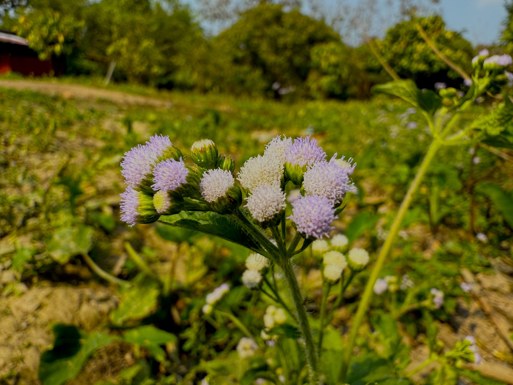

# 20250208_chiangrai

<html>
<head>

<meta charset="UTF-8">
<meta http-equiv="Content-Type" content="text/html; charset=UTF-8">
<meta http-equiv="X-UA-Compatible" content="IE=EmulateIE10" />
<meta http-equiv="X-UA-Compatible" content="IE=edge">

<!--ここから上はお決まりの定型文です-->

<!--ここからが表現の書式などを決めるcssという部分-->

<link href="https://cdnjs.cloudflare.com/ajax/libs/lightbox2/2.7.1/css/lightbox.css" rel="stylesheet">

</head>

<body>

モバイル端末をお使いの場合は、画面を横向きにすると
より見やすくご覧頂けます。

<!--ここ上は、ほぼそのまま使います！-->

<!--QRコードの挿入例-->

 アクセス用QRコード

<marquee direction="left" scrollamount="20" width="30%">(^_^)/~alis</marquee>

<!--流れ文字の挿入例-->
<h1><marquee behavior="left">!!! 2025/02/08、綺麗な朝焼けで始まり、ちびっ子のお相手と庭の鳥やお花で1日が暮れました!!!</marquee></h1>

                          

<!--ここから下が、本体部分-->

<h2>日の出と共に朝焼けグラデーション 朝7:13~16</h2>

<h2>お日様が雲の後ろで、日章旗状態</h2>

    
<h2>ちびっ子はニワトリのカゴでおおはしゃぎ</h2>

    
<h2>切り株になったのに新緑が噴き出た生命力溢れる木</h2>

    
<h2>蓮はピンクと白がおそろい</h2>

    
<h2>鳥たちも元気です</h2>

    
<h2>野鳥4羽が屋根の上で大騒ぎ</h2>
<iframe width="560" height="315" src="https://www.youtube.com/embed/XRILg4qM4nA?si=HUcfARJkQp0tXrHi" title="YouTube video player" frameborder="0" allow="accelerometer; autoplay; clipboard-write; encrypted-media; gyroscope; picture-in-picture; web-share" referrerpolicy="strict-origin-when-cross-origin" allowfullscreen></iframe> 
    
<h2>庭の生き物たち</h2>

    
<h2>新緑が映えるので良く見るとてっぺんの新芽にお花が咲きました</h2>

    
<h2>郵便配達員は完全に日光遮断してます</h2>

    
<h2>浮き草の上に水玉がキラリ</h2>

<h2>アリさんサイズのハチです</h2>

    
<h2>ニワトリ一家が餌に集まりました</h2>

    
<h2>西の空が曇りで、夕焼けはイマイチか？</h2>

    
<h2>空を見上げるとお月様</h2>

    
<h2>月齢 9.7</h2>

<h2>しばらくすると夕陽に染まりました</h2>

    
<h2>夕焼け空は意外と綺麗</h2>

  
<h2>今日のBGMはカノン、1600年代後半の曲ですが今聴いてもいいですね</h2>
<iframe width="560" height="315" src="https://www.youtube.com/embed/lJxdEHg9cqA?si=5NmKJp_oMfz29q7v" title="YouTube video player" frameborder="0" allow="accelerometer; autoplay; clipboard-write; encrypted-media; gyroscope; picture-in-picture; web-share" referrerpolicy="strict-origin-when-cross-origin" allowfullscreen></iframe> 

  
<h2>カノン２連発ですが、これも良かったのリンク貼りますね</h2>
<iframe width="560" height="315" src="https://www.youtube.com/embed/EdlibdaVg54?si=7OUsxrSFWOiG0eLa" title="YouTube video player" frameborder="0" allow="accelerometer; autoplay; clipboard-write; encrypted-media; gyroscope; picture-in-picture; web-share" referrerpolicy="strict-origin-when-cross-origin" allowfullscreen></iframe> 

   
<h2>以上、ほぼ出歩かずに過ごした1日でした ここまで観ていただきありがとうございました。</h2>

     
<h2>
<a href="https://torokoid.github.io/20241126_chiangrai/" target="_blank">Back to the menu page</a>
</h2>

   

         

  

      

<!--本体はここまで-->

<!--画面に空白地帯を作って、背景が見えるようにしています-->
                                              

<!-- フッタ -->
<footer>

Copyright 2025/02/09 alis @ChiangRai

</footer>

<!--HPにさまざまなJavaScriptを呼び込むための書式-->

